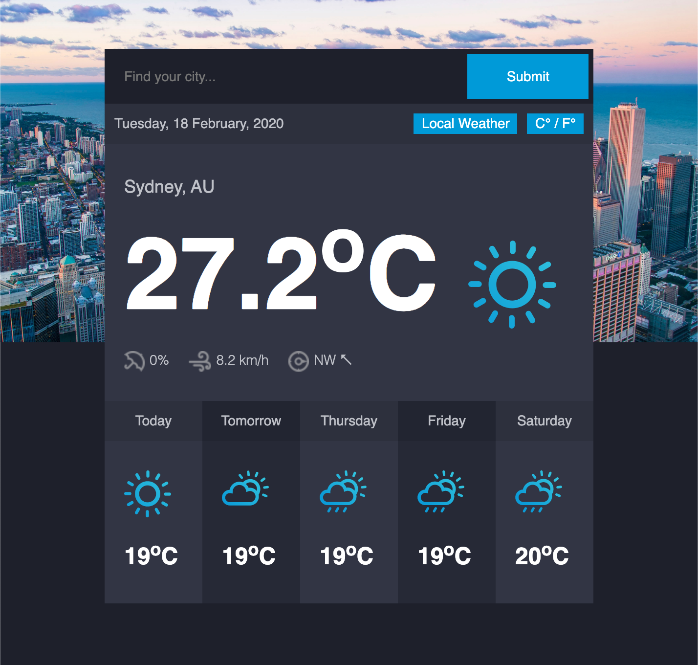

# Project : Weather App 🌞
<p>
<a href="https://github.com/winplam/weather-app/blob/master/LICENSE">

</a></p>

This project was created as an assignment for The Odin Project [JavaScript course](https://www.theodinproject.com/courses/javascript)
 demonstrating mastery of key concepts such as Promises, Async/Await, Fetch/API usage, and JSON usage.
I've also went above and beyond the requirements of the project implementing IP location feature (Local Weather button), React.JS usage, localStorage for auto saving settings, and a nifty city suggestions dropdown.
I chose to first use .then/.catch and latter refactor to async/await to get proficiency with using different ways of working with asynchronous code.


### [Live Demo ](https://winplam.github.io/weather-app/)


## Key Concepts
* Promise (then/catch) on "promise" branch
* Async / Await
* Fetch / API usage
* JSON

## Tech Stack
* React.JS
* JavaScript ES6
* HTML5 / CSS3

## Resources Used
* [OpenWeather API](https://openweathermap.org/api): Provides live weather data for cities all over the world
* [date-fns](https://date-fns.org/): JavaScript library to format Unix date code into a human friendly format
* [D3.js](https://d3js.org/) This library was used to load CSV files
* [DataHub](https://datahub.io/core/world-cities) Provided download of CSV file containing list of cities from all over the world
* [Suggestions component](https://github.com/tristen/suggestions) Use for making a suggestions dropdown of the possible cities
* [Unsplash](https://unsplash.com/): Used for the beautiful free background image



## Run Locally
To run this project locally, clone the repository locally (or download the zip file) 
```bash
git clone git@github.com:winplam/weather-app.git
cd weather-app
```
Install dependencies listed in the package.json file 
```bash
npm install
```
You will need a free API key from [OpenWeather API](https://openweathermap.org/api) and save it as a ".evn" file in the root of this project.
Then add the following line to the ".env" file replacing the key with your actual API key. 
```bash
REACT_APP_OPENWEATHER_API_KEY='1234567890ABCDEFGHIJKLMNOPQRSTUVWXYZ'
```
Launch the React.JS app
```bash
npm start
```
Your browser should open up automatically. If not, point your browser to http://localhost:3000/